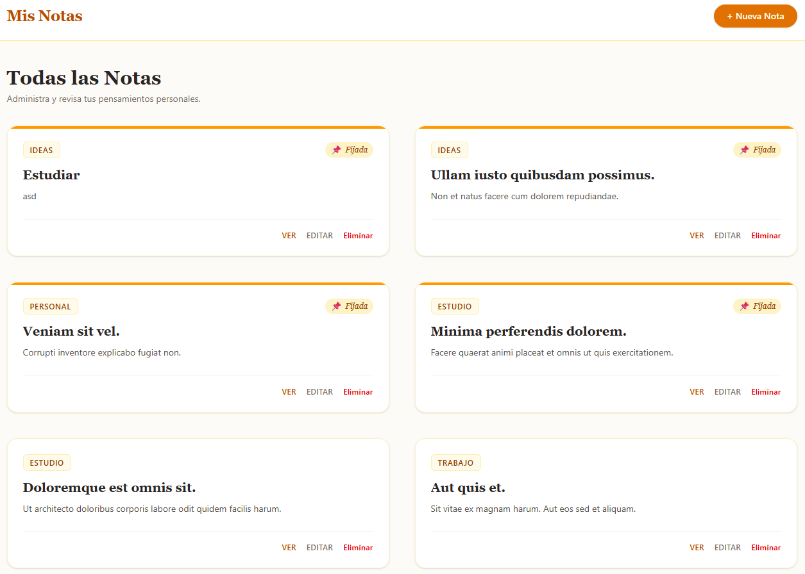
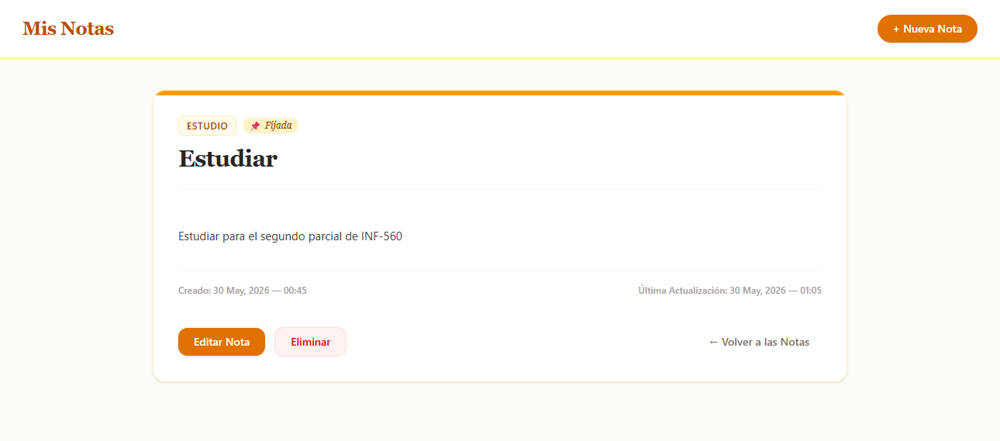
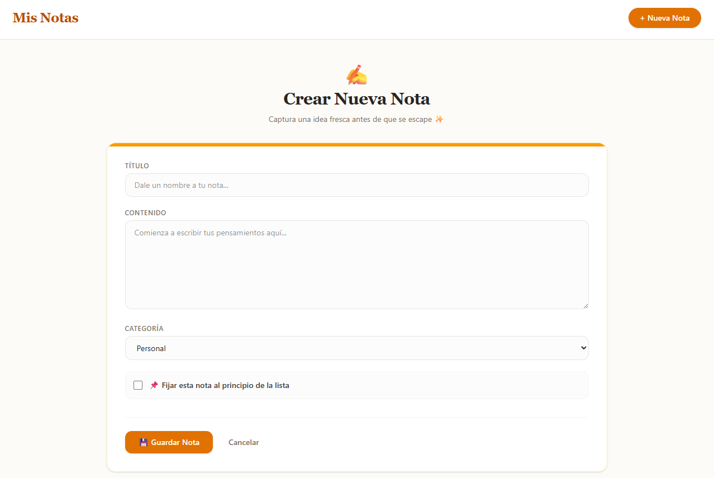
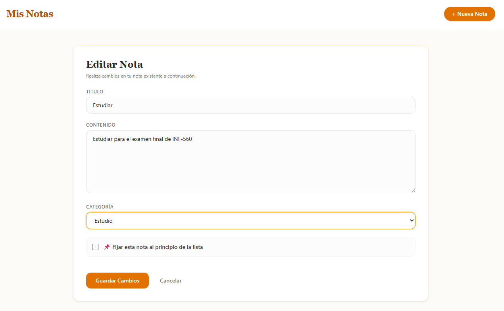
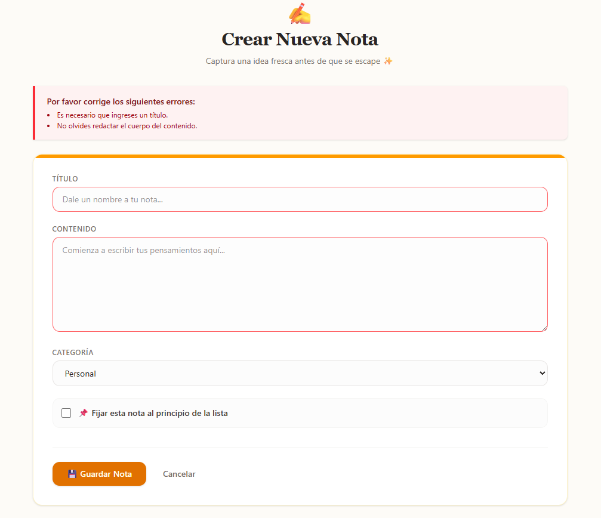

# Notas APP (INF-560) / Práctica 4

# Vistas en funcionamiento

### Listado de todas las notas

<p align="center">
  
</p>

### Detalles de una nota

<p align="center">
  
</p>

### Creación de una nota

<p align="center">
  
</p>

### Edición de una nota

<p align="center">
  
</p>

### Mensajes de validación

<p align="center">
  
</p>

## Guía de Instalación

### 1. Clonar el Repositorio

```bash
git clone https://github.com/svvxyz/INF560-Practica4.git
cd INF560-Practica4
```

### 2. Crear la Base de Datos y Asignar Permisos en PostgreSQL

```bash
psql -U postgres
```

Dentro de PostgreSQL:

```sql
CREATE DATABASE notas_app_db OWNER nombre_usuario;
GRANT ALL PRIVILEGES ON DATABASE notas_app_db TO nombre_usuario;
```
### 3. Configurar Variables de Entorno

```bash
cp .env.example .env
```

Edita `.env` con tus credenciales:

```env
DB_DATABASE=notas_app_db
DB_USERNAME=nombre_usuario
DB_PASSWORD=tu_password
```

### 4. Instalar Dependencias PHP

```bash
composer install
```

### 5. Generar Clave de Aplicación

```bash
php artisan key:generate
```

### 6. Ejecutar Migraciones y Seeders

```bash
php artisan migrate --seed
```

### 7. Instalar e Iniciar Dependencias Frontend (Obligatorio)

```bash
npm install
npm run dev
```

### 8. Iniciar el Servidor

```bash
php artisan serve
```